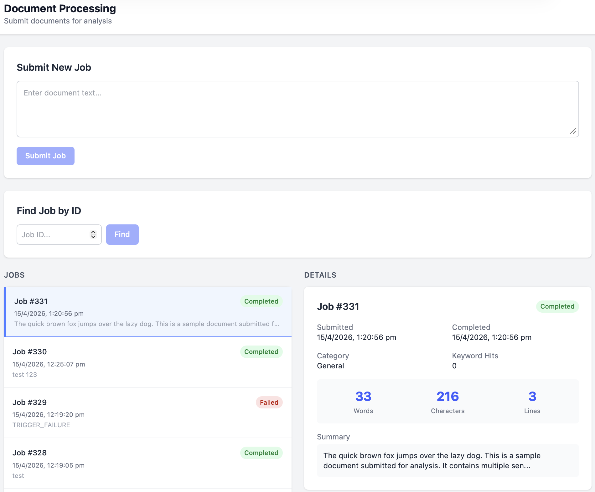

# Document Processing UI

[](https://react.dev)
[](https://www.typescriptlang.org)
[](https://vitejs.dev)
[](https://tailwindcss.com)

A React + TypeScript frontend for the [Document Processing API](https://github.com/juhagh/document-processing-api).

Allows users to submit document analysis jobs, track job status in real time, and view analysis results.



## Features

- Submit document text for asynchronous analysis
- Browse all jobs ordered by submission time
- Look up any job by ID
- Real-time status polling for active jobs
- Analysis result display including word count, character count, line count, and summary
- Status badges with colour coding per job state
- Responsive two-column layout

## Tech Stack

- React 19
- TypeScript
- Vite
- Tailwind CSS
- Axios

## Related Repository

- [Document Processing API](https://github.com/juhagh/document-processing-api) — ASP.NET Core backend with RabbitMQ worker and PostgreSQL persistence

## Prerequisites

- Node.js 20+ (via [NVM](https://github.com/nvm-sh/nvm) recommended)
- [Document Processing API](https://github.com/juhagh/document-processing-api) running locally

## Getting Started

**1. Clone the repository**

```bash
git clone https://github.com/juhagh/document-processing-ui.git
cd document-processing-ui
```

**2. Install dependencies**

```bash
npm install
```

**3. Start the development server**

```bash
npm run dev
```

The UI will be available at `http://localhost:5173`.

> The API is expected to be running at `http://localhost:8080`. 
> The Vite dev server proxies all `/api` requests to the API automatically.

## Project Structure

```text
src/
  api/          # Axios API client
  components/   # React components
  types/        # TypeScript type definitions
  App.tsx       # Root component and application state
  main.tsx      # Entry point
```

## Component Overview

- **SubmitJobForm** — text input and submission handling with loading and error states
- **GetJobById** — look up a specific job by ID
- **JobList** — scrollable list of all jobs with selection highlighting
- **JobDetail** — full job detail view with analysis results and active job polling
- **StatusBadge** — colour coded status indicator reused across components

## How It Works

1. User submits document text via the form
2. UI posts to `POST /api/jobs` and adds the new job to the list
3. If the job is in `Queued` or `Processing` state, the UI polls `GET /api/jobs/{id}` every 3 seconds
4. Once the job reaches `Completed` or `Failed`, polling stops and results are displayed

## Planned Improvements

- Pagination for job list
- Filter jobs by status
- Toast notifications for job completion
- Environment variable configuration for API base URL

## License

MIT
